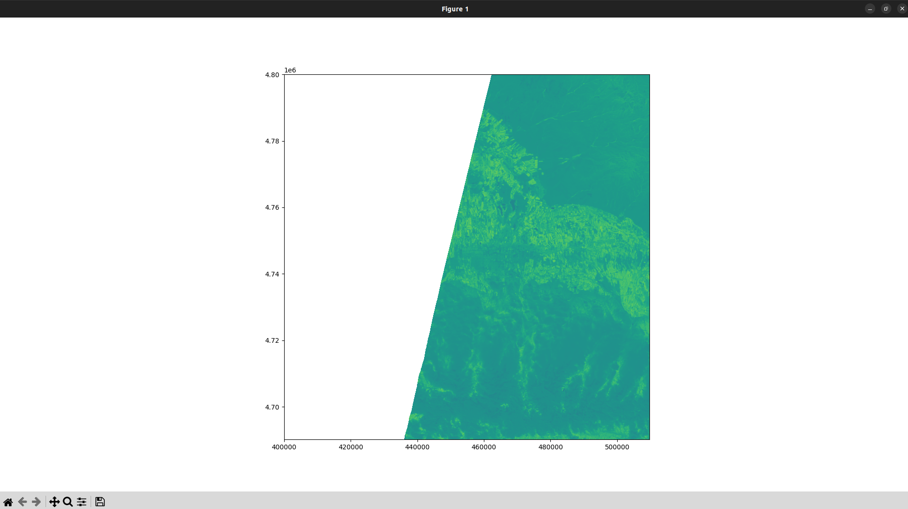

# NDVI calculator
- This scripts for converting from .jp2 to tiff. And calculating NDVI index
- Эти скрипты для преобразования из .jp2 to tiff. И высчитывания  индекса NDVI

## Development setup
### Prerequisites

- Python 3.10
## Install project
```commandline
git clone git@github.com:TIP-ROK/ndvi-calculator.git
```
## Required
```
- create files: 
    - images (download .jp2 files from 
    https://drive.google.com/drive/folders/1OoE7WryYVa4YPfYKYY7k_NAXWrzhUKOC?usp=sharing)
    - output
    - result
```

## Install requirements
```commandline
pip install -r requirements.txt
```
## Run
```commandline
python jp2_tiff.py
python ndvi_calculator.py
```
## After running scripts abowe ypu wel get this picture and saved tiff file in result directory


## get coordinates
```commandline
rio bounds output/sentinel3.tif --indent 2
```
